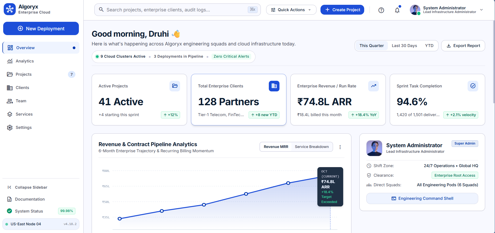
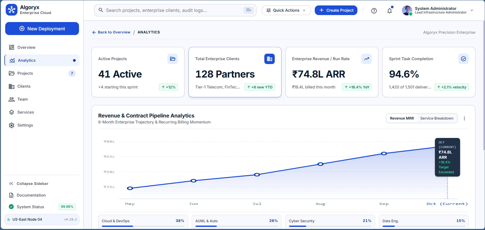
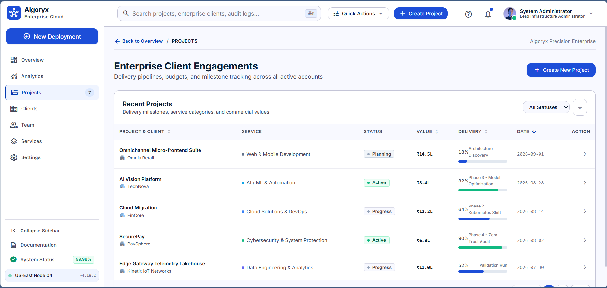

# Algoryx Technologies — Enterprise Cloud Admin Dashboard

A modern, responsive React Admin Dashboard designed around an enterprise SaaS experience for **Algoryx Technologies**. The dashboard provides a unified interface for monitoring enterprise engagements, financial metrics, analytics, engineering activity, notifications, and operational workflows.

This application is a **frontend-only** implementation built with pure React functional components, hooks, and local state management. All metrics, client portfolios, financial trajectories, and alert feeds are powered by structured mock data reflecting Algoryx's institutional technology service practices — without requiring any backend servers, external databases, or third-party authentication services.

---

## Live Demo

- **Deployment URL:** [Algoryx Admin Dashboard](https://algoryx-admin-dashboard-pearl.vercel.app) 

---

## GitHub Repository

- **Source Code:** [https://github.com/druhi-c/algoryx-admin-dashboard](https://github.com/druhi-c/algoryx-admin-dashboard)

---

## Key Features

- **Responsive Desktop / Tablet / Mobile Layout:** Engineered to deliver a cohesive experience across all screen sizes, from 1440px desktop workstations down to 375px mobile displays, eliminating unintended horizontal overflow.
- **Collapsible Desktop Sidebar:** Dual-mode navigation allowing instant switching between an expanded navigation view (`16rem` / 256px) and a compact icon-only view (`4.5rem` / 72px) with persistent cluster status telemetry (`US-East Node 04 | 99.98% Uptime`).
- **Mobile Navigation Drawer:** Slide-out drawer with a dark backdrop blur overlay (`bg-[#0F172A]/40`) that closes on backdrop click or route selection.
- **Global Command Search:** Header search bar with real-time keyword filtering across project titles, clients, service domains, and status tags, complete with a quick-clear (`X`) button.
- **Ctrl+K / Cmd+K Search Shortcut:** Global keyboard event listener powered by custom React hooks to immediately focus the search bar from anywhere within the application.
- **Quick Actions Menu:** Dropdown providing rapid operator shortcuts for *New Deployment*, *Command Shell*, *Export Report*, and *Cluster Security Audit*.
- **Notifications Panel:** Interactive notification center displaying unread badge counts, category pills, relative timestamps, individual alert dismissals, and a *Mark all read* action.
- **Profile Menu:** System administrator dropdown displaying FedRAMP Level 4 credentials, 24/7 on-call shift status, active squad rosters, and session locking.
- **KPI / Overview Cards:** Four Bento metric cards monitoring Active Projects, Enterprise Client Partners, Annual Run Rate (ARR in ₹ Lakhs), and Sprint Task Completion with positive/negative trend indicators.
- **Interactive Analytics:** High-precision SVG area/line chart with blue gradient fill, active pulse nodes, vertical dashed crosshair, and floating hover tooltips displaying monthly ARR, target, and variance.
- **Dynamic Time-Range Toggling:** Instant switching between *This Quarter*, *Last 30 Days*, and *YTD* that recalculates chart coordinates, data points, and period metrics in real-time.
- **Service Breakdown View:** Visual distribution breakdown representing Algoryx's six core technology capabilities with custom semantic progress bars and ARR allocation figures.
- **Recent Projects Data Grid:** Comprehensive data table tracking Project & Client, Service Domain, Status, Contract Value (in ₹ Lakhs), Delivery Progress, Kickoff Date, and Row Actions.
- **Multi-Column Sorting:** Column header sorting on Project Name, Contract Value, Delivery Progress, and Kickoff Date with visual ascending/descending indicator icons.
- **Status Filtering:** Dedicated status dropdown filter (*All Statuses*, *Active*, *Progress*, *Completed*, *Planning*) with instant table recalculation.
- **Table Pagination:** Client-side pagination with previous/next controls, page number buttons, and responsive item count summaries.
- **Project Details Modal:** Deep-dive modal revealing contract value, milestone progress, AWS cluster infrastructure (VPC peering, ECS Fargate), and FedRAMP security posture.
- **Create Project Modal:** Accessible dialog with Level 4 elevation and backdrop blur to dynamically provision new client engagements, automatically appending them to the data grid and streaming an event alert into the notification feed.
- **Simulated Command Shell:** Interactive diagnostic CLI terminal emulator supporting `status`, `clusters`, `deployments`, `help`, and `clear`.
- **Reusable Component Architecture:** Modular structure separating layout components, dashboard widgets, and UI primitives for clean maintainability.
- **Custom React Hooks:** Encapsulated custom hooks for outside-click detection (`useClickOutside`) and global keyboard shortcuts (`useKeyboardShortcut`).
- **Accessibility-Focused Interactions:** Built with semantic HTML elements (`<button>` instead of clickable `<div>`s), accessible ARIA attributes (`role="dialog"`, `role="progressbar"`, `aria-modal`), and high-contrast visible focus rings (`:focus-visible`).
- **Reduced-Motion Support:** Built-in `@media (prefers-reduced-motion: reduce)` rules that automatically suppress or dampen animations for users with motion sensitivities.

---

## Tech Stack & Architecture

- **Core Framework:** React 18 (`^18.3.1`) & React DOM (`^18.3.1`)
- **Build Tool & Dev Server:** Vite (`^5.4.14`) via `@vitejs/plugin-react` (`^4.3.4`)
- **Styling & CSS:** Tailwind CSS (`^3.4.17`), PostCSS (`^8.4.49`), Autoprefixer (`^10.4.20`)
- **Language:** JavaScript (ES6+ / JSX)
- **Typography:** Inter (loaded via Google Fonts)
- **Iconography:** Google Material Symbols Outlined
- **Data & State Management:** Pure client-side React architecture leveraging `useState`, `useEffect`, `useMemo`, and custom hooks with structured mock datasets in `src/data/mockData.js`. Zero external chart libraries or heavy state containers are used — charts are custom-rendered SVG vectors.

---

## Project Structure

```
algoryx-dashboard/
├── index.html                   # HTML entrypoint with font & symbol links
├── package.json                 # Project dependencies & npm scripts
├── vite.config.js               # Vite bundler configuration
├── tailwind.config.js           # Extended design tokens matching DESIGN.md
├── postcss.config.js            # PostCSS configuration
├── DESIGN.md                    # Algoryx Precision Enterprise Design System
├── screenshots/                 # Application preview screenshots
│   └── .gitkeep
├── src/
│   ├── main.jsx                 # Application mount point into #root
│   ├── App.jsx                  # Top-level state and visual hierarchy orchestrator
│   ├── index.css                # Tailwind directives, custom scrollbar & a11y focus rings
│   ├── data/
│   │   └── mockData.js          # Centralized store for engagements, revenue & alerts
│   ├── hooks/
│   │   ├── useClickOutside.js   # Reusable hook for dropdown outside-click dismissal
│   │   └── useKeyboardShortcut.js # Reusable hook for global keyboard shortcuts (⌘K / Ctrl+K)
│   ├── components/
│   │   ├── layout/
│   │   │   ├── AppShell.jsx     # Master layout container with sidebar offsets
│   │   │   ├── Sidebar.jsx      # Desktop collapsible & mobile drawer navigation
│   │   │   └── TopNav.jsx       # Header with search, quick actions, notifications & profile
│   │   ├── dashboard/
│   │   │   ├── ExecutiveBrief.jsx   # Welcome greeting, cluster health pills & period selector
│   │   │   ├── OverviewCards.jsx    # Bento KPI metrics grid
│   │   │   ├── StatCard.jsx         # Reusable individual KPI card
│   │   │   ├── AnalyticsSection.jsx # 6-month interactive SVG chart & service breakdown
│   │   │   ├── ProjectsTable.jsx    # Searchable, sortable & filterable Recent Projects table
│   │   │   ├── ProfileCard.jsx      # System Administrator credential & shift overview
│   │   │   ├── AlertsFeed.jsx       # Real-time dismissible operational alerts feed
│   │   │   └── ActivityTimeline.jsx # Engineering squad activity and deployment timeline
│   │   └── ui/
│   │       ├── Badge.jsx              # Status badges adhering to DESIGN.md color rules
│   │       ├── Card.jsx               # Standard Level 1 elevation container
│   │       ├── ProgressBar.jsx        # Accessible semantic progress bar component
│   │       ├── CreateProjectModal.jsx # Engagement provisioning modal dialog
│   │       ├── ProjectDetailsModal.jsx# Engagement dossier & cloud infrastructure modal
│   │       ├── QuickActionsMenu.jsx   # Quick actions dropdown menu
│   │       ├── NotificationDropdown.jsx # Notification panel with unread badge counter
│   │       ├── ProfileMenu.jsx        # Administrator profile and credentials menu
│   │       └── CommandShellModal.jsx  # Interactive diagnostic terminal emulator
```

---

## Getting Started

### Prerequisites

- **Node.js:** v18.0.0 or higher
- **npm:** v9.0.0 or higher

### Installation

Clone the repository and install the dependencies:

```bash
git clone https://github.com/druhi-c/algoryx-admin-dashboard.git
cd algoryx-admin-dashboard
npm install
```

### Development Server

Start the local Vite development server with Hot Module Replacement (HMR):

```bash
npm run dev
```

Open your browser and navigate to `http://localhost:5173`.

### Production Build & Preview

Compile the production-optimized bundle:

```bash
npm run build
```

Preview the production build locally:

```bash
npm run preview
```

---

## Design System

The application strictly enforces the specifications established in [`DESIGN.md`](./DESIGN.md):

- **Primary Color:** `#1D4ED8` (Algoryx Royal Tech Blue) for interactive controls, active indicators, and links.
- **Surface Elevation Hierarchy:**
  - *Level 0 (Canvas):* `#F8FAFC` base application background.
  - *Level 1 (Card/Container):* `#FFFFFF` with micro-borders (`1px solid #E2E8F0`) and subtle shadows (`0 1px 3px 0 rgba(15, 23, 42, 0.05)`).
  - *Level 4 (Modals & Overlays):* Elevated dialogs with `backdrop-filter: blur(4px)` and high-depth shadows.
- **Typography:** Inter across all headings, body text, and labels. Enforces `tabular-nums` (`font-variant-numeric: tabular-nums`) across all financial metrics, dates, and progress percentages for vertical numeral alignment.
- **Visual Rhythm:** 8pt spatial grid rhythm with consistent padding tokens (`p-space-sm`, `p-space-md`, `p-space-lg`, `gap-space-xl`).
- **Official Algoryx Service Competencies:**
  1. Web & Mobile Development
  2. Cloud Solutions & DevOps
  3. AI / ML & Automation
  4. Cybersecurity & System Protection
  5. Data Engineering & Analytics
  6. Product Engineering & Consulting

---

## Responsive Design

The dashboard has been verified and hardened across all standard viewports:

| Viewport Width | Form Factor | Layout Behavior |
| :--- | :--- | :--- |
| **1440px+** | Large Desktop / Workstation | Full `16rem` sidebar, 4-column Bento grid, balanced 8/4 analytics row, full-width Recent Projects grid, capped at 1600px max canvas. |
| **1280px** | Standard Desktop | Full persistent sidebar, 4-column Bento grid, full table data without horizontal scrolling. |
| **1024px** | Small Desktop / Tablet Landscape | Collapsible sidebar to `4.5rem` icon mode, 2x2 Bento grid, flexible table with horizontal scroll wrapper. |
| **768px** | Tablet Portrait | Sidebar transitions to slide-out drawer mode with hamburger trigger; columns stack cleanly without element collision. |
| **640px** | Phablet / Large Mobile | Single-column card stack; header controls collapse into drawer; table remains fully usable with smooth card-bound scroll. |
| **480px / 375px** | Compact Mobile | Single-column cards; health pills wrap gracefully (`rounded-2xl`); dropdowns clamped to `calc(100vw - 2rem)` to prevent page overflow. |

---

## Screenshots

| Desktop Overview | Analytics & Trajectory |
| :---: | :---: |
|  |  |

| Recent Projects Table | Mobile View |
| :---: | :---: |
|  |  |

*(To populate screenshots, save preview captures of the application into the `screenshots/` directory matching the filenames above).*

---

## Author

- **Druhi Chakraborty**
- **GitHub:** [@druhi-c](https://github.com/druhi-c)
- **Repository:** [algoryx-admin-dashboard](https://github.com/druhi-c/algoryx-admin-dashboard)
